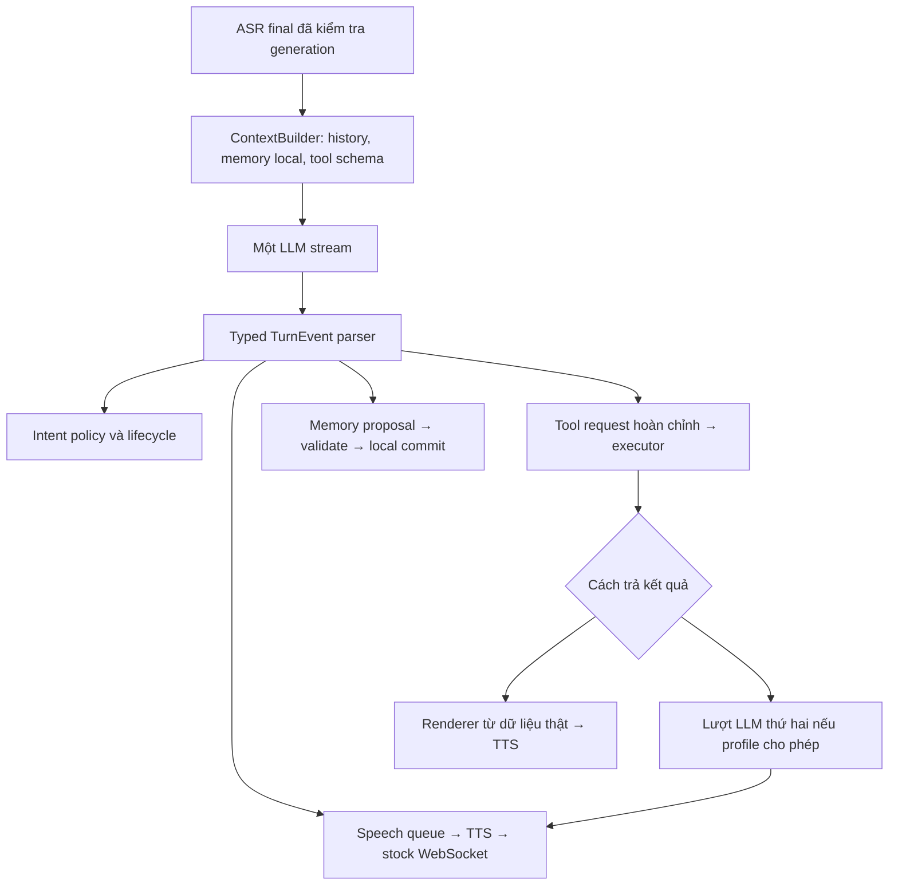

# Pipeline phản hồi dưới 1 giây: Intent, Memory và Function Calling

Status: `PARTIAL`

Created: `2026-09-08`

## Goal

Tối ưu thời gian từ lúc người dùng nói xong đến khi bắt đầu nhận câu trả lời có nội dung: mục tiêu p95 < 1.000 ms, hướng đến p50 khoảng 600 ms trong điều kiện tải được công bố. Xây dựng Intent, Memory và khả năng gọi function/tool dùng chung một luồng điều phối, giữ hội thoại tiếng Việt tự nhiên và tương thích firmware Xiaozhi nguyên bản.

Nguyên tắc: **một lần suy luận LLM cho lượt chat thông thường**, gồm quyết định ý định, lời nói, cảm xúc và đề xuất cập nhật memory. Đọc memory là truy vấn local; thực thi tool là công việc của server. Không thêm LLM phân loại, hiệu chỉnh ASR, chọn memory hay tóm tắt đồng bộ trước câu trả lời.

Đây là tài liệu handoff theo yêu cầu lập task. Chưa triển khai code trong task này; executor chỉ thực hiện khi được yêu cầu, cập nhật checklist và bằng chứng vào chính file này. Phạm vi lập plan không bao gồm commit/push mới.

## Current state

### Baseline và nguồn bằng chứng

- VeeTee HEAD: `c66ab63b06bb45c276f8209224b0c1c9dab11f3d`; working tree sạch khi bắt đầu rà.
- Đã đọc source, cấu hình local theo whitelist không chứa secret, `/health`, `/api/diagnostics` và snapshot journal của `veetee-server-bg.service`. Service đang `active/running`, health `healthy`; không khởi chạy server foreground và không tạo lượt gọi model để benchmark trong bước lập plan.
- FW reference: `c7241272f2d5fd140c77542f3cf12d09e717fc2f`; worktree sạch, HEAD đúng [REFERENCE_BASELINES.md](../REFERENCE_BASELINES.md). Đọc bằng `git show`/`git grep` tại commit này, gồm `main/mcp_server.cc`, `main/protocols/websocket_protocol.cc`, `main/protocols/protocol.cc` và `docs/mcp-protocol.md`.
- Plan hội thoại trước còn `PARTIAL`, thiếu benchmark lặp và hardware: [hội thoại tự nhiên](2026-09-08-hoi-thoai-tu-nhien-khong-sua-fw.md). Không đánh dấu hoàn tất các phần đó chỉ vì tạo plan mới.
- `docs/VOICE_PIPELINE_STATUS.md` còn mô tả greeting/goodbye cố định và số test cũ; source hiện đã có AI greeting/goodbye và inline end intent. Khi thực thi cần đồng bộ tài liệu theo bằng chứng mới, không dùng tài liệu cũ thay source.

### Pipeline thực tế

```mermaid
flowchart LR
    A[Mic PCM16 hoặc Opus] --> B[Decode và Silero VAD]
    B --> C[Chờ kết thúc câu]
    C --> D[Queue và Parakeet nhận dạng cả câu]
    D --> E[ASR final và capture guard]
    E --> F[History trong RAM]
    F --> G[OmniRoute: một LLM stream]
    G --> H[Parse end/continue và chia câu]
    H --> I[Queue tối đa 3 clause]
    I --> J[VieNeu: engine dùng chung]
    J --> K[Resample, Opus và AudioPacer]
    K --> L[WebSocket, buffer client và loa]
```

| Thành phần | Hiện trạng kiểm chứng | Cơ hội / giới hạn |
| --- | --- | --- |
| ASR/VAD | `parakeet_silero.py`: frame VAD 32 ms, end silence cấu hình 450 ms, thực tế ngưỡng 480 ms; Parakeet chạy sau endpoint, dùng inference lock chung | Riêng endpoint đã dùng gần hết ngân sách 600 ms; cần đo queue/inference riêng và thử endpoint ngắn hơn |
| ASR correction | Local và example đều `text_correction_enabled=false`; code vẫn có nhánh gọi LLM hiệu chỉnh | Profile tốc độ phải ngăn bật lại call phụ một cách âm thầm |
| LLM | `omniroute_groq.py`: model route `groq/qwen/qwen3.6-27b`, streaming qua `/chat/completions`, HTTP session dùng lại, `reasoning_effort=none`, max output hiện 600 token | Đã có connection reuse; không tính việc thêm keepalive là tối ưu mới. Tên route không chứng minh model backend thực tế hay khả năng native tools |
| Intent | `[end]/[continue]` trong chính stream chat; provider không có inline control vẫn có nhánh classifier riêng | Cần contract chính thức thay `getattr` và tuple biến độ dài; mở rộng ý định không tăng số call |
| Chia câu | `SpeechSegmentSplitter`: min 28 ký tự nhìn thấy; clause target 150, clause min 80, hard max 240 | Câu đầu ngắn có thể bị giữ đến câu sau hoặc stream EOF; tối ưu riêng câu đầu, giữ ngữ điệu các câu sau |
| TTS | VieNeu đã warmup và `chunk_frames=1`; queue bridge 4 chunk, engine lock dùng chung | Không còn nút giảm buffer 25→1 để làm lại; cần đo lock wait, thời gian first PCM/Opus, cạnh tranh với cache và dashboard |
| Pacing | Output 24 kHz, frame 60 ms; send-ahead mặc định 120 ms | Giới hạn audio gửi trước và đuôi ngắt; không mặc định xóa pacing để giảm latency |
| Greeting | Pool AI dùng chung, prewarm trước khi mở listener; còn fallback tạo pool theo session khi pool chung trống | Prewarm thất bại vẫn khiến wake lạnh chờ LLM/TTS; cache miss chờ toàn clip |
| Memory | `DialogueContext(max_history_turns=10)` tại session; giữ tối đa 20 message trong RAM | Chưa có memory qua reconnect, token budget, tìm kiếm, xóa hay phân lập chủ sở hữu |
| Tools | Provider chỉ đọc `delta.content`; chưa parse `delta.tool_calls`, chưa có registry/executor/result loop | `MessageType.MCP` mới là enum; session chưa xử lý MCP |
| Định danh | Session đọc `Device-Id`/`Client-Id`, mặc định `unknown`; chưa có ràng buộc owner đã xác thực cho memory | Không dùng header tự khai báo làm khóa truy cập memory cá nhân |
| Đo đạc | `Post-ASR` bắt đầu trong `_process_ai_response`, sau callback ASR và correction nếu có | Thiếu thời gian endpoint, ASR, token đầu, TTS lock, client playback; còn chỗ ghi nhận gửi binary mà chưa xét boolean kết quả send |

### Số đo hiện có và cách diễn giải

Snapshot journal ngày 08/09 sau lần server READY lúc 14:44:03 có ba lượt:

| Thời điểm log | ASR final → first LLM clause | ASR final → first TTS binary | Chênh lệch clause → binary |
| --- | ---: | ---: | ---: |
| 14:44:58 | 472 ms | 589 ms | 117 ms |
| 14:45:10 | 746 ms | 873 ms | 127 ms |
| 14:45:44–45 | 536 ms | 659 ms | 123 ms |

Đây là ba mẫu lịch sử của luồng browser, endpoint `client_finalize`; không phải benchmark p50/p95 của commit hiện tại, cũng không bao gồm toàn bộ thời gian người dùng chờ. Không cộng ngưỡng silence 480 ms vào chính các lượt finalize thủ công này. Với đường auto thật, ngưỡng silence là một nguồn trễ bổ sung cần đo trực tiếp.

Journal còn ghi prewarm lúc 14:43:33 không có câu hợp lệ; wake lạnh lúc 14:46:03 mất 3.885 ms đến first binary, lần hit kế tiếp mất 151 ms. Cache có chuỗi chứa `[neutral]`/`[relaxed]`: cần kiểm tra và chuẩn hóa metadata trước TTS. Các mẫu này xác định trường hợp cần sửa, không chứng minh lần chạy mới đã hết lỗi.

## Scope

- In scope: telemetry, benchmark tái lập, tối ưu endpoint/ASR/câu đầu/TTS scheduling, một stream LLM hợp nhất, semantic intent, memory local bền vững, tool registry/execution, adapter native function calling và MCP stock, config/diagnostics/test/tài liệu.
- Ưu tiên hoàn thành theo các milestone độc lập: M0 đo đúng; M1 phản hồi nhanh; M2 Intent + Memory; M3 Function Calling + MCP; M4 nghiệm thu runtime/hardware.
- Out of scope: sửa/build/flash firmware, server AEC mới, tự bật voice barge-in, đổi model/provider không có benchmark, agent nhiều tầng không giới hạn, cloud vector DB bắt buộc, đồng bộ memory nhiều máy, marketplace tool, triển khai mọi dịch vụ bên ngoài như weather/calendar/email.
- Tool tích hợp đầu tiên chỉ cần đủ chứng minh nền tảng hoạt động: đồng hồ server, phép tính có giới hạn, tool giả để test lỗi/side effect, và status/volume của thiết bị nếu được stock MCP công bố.

## Thiết kế mục tiêu

### Định nghĩa tốc độ và ngân sách

Đặt tên metric theo mốc thật, dùng monotonic clock trong mỗi process; không lấy timestamp client trừ timestamp server nếu chưa đồng bộ.

| Metric | Định nghĩa | Tiêu chí |
| --- | --- | --- |
| `speech_end_to_first_audio_received_ms` | Kết thúc tiếng nói đã đánh dấu trong fixture → binary đầu nhận tại cùng client | Chat nóng trên LAN: p95 < 1.000 ms; mục tiêu p50 ≤ 600 ms |
| `speech_end_to_first_audible_ms` | Hết tiếng nói → âm câu trả lời đầu trên loa, cùng bản ghi âm đo | Cùng mục tiêu trải nghiệm; bắt buộc có đo ESP32 thật trước khi tuyên bố đạt |
| `post_asr_first_audio_sent_ms` | ASR final được chấp nhận → binary đầu gửi thành công | Metric phân tích nội bộ; không dùng làm SLA trải nghiệm |
| `wake_to_first_audio_ms` | Wake detect → audio greeting đầu | Cache nóng p95 ≤ 250 ms; cold/error báo riêng |
| `tool_first_feedback_ms` / `tool_final_result_ms` | Feedback đầu / kết quả đã kiểm chứng của lượt dùng tool | Tách hai phân phối; không coi lời “đang kiểm tra” là kết quả cuối dưới 1 giây |

Ngân sách thiết kế **giả thuyết**, chưa đo đạt: endpoint 192 ms + ASR queue/infer 70 ms + context 8 ms + LLM đến câu đầu 200 ms + TTS/encode 100 ms + vận chuyển/buffer 30 ms ≈ 600 ms. 192 ms là bội của frame VAD 32 ms, nhưng có nguy cơ cắt câu khi ngập ngừng. Nếu provider, GPU hoặc loa vượt ngân sách, ghi phần vượt và điều chỉnh bằng benchmark; không cam kết mọi câu/mọi mạng đều 600 ms. Không cộng các p95 từng tầng thành p95 end-to-end.

Binary đầu có thể chứa silence của TTS. Benchmark phải ghi thêm thời điểm PCM có tiếng sau decode và lượng leading silence; beep, audio im lặng hoặc lời đệm không được tính là bắt đầu câu trả lời có nội dung. Chỉ số packet phục vụ phân tích transport, chỉ số acoustic phục vụ kết luận trải nghiệm.

### Một lần LLM: contract và ngoại lệ hữu hạn

| Loại lượt | Số LLM call mục tiêu | Hành vi |
| --- | ---: | --- |
| Chat, hỏi lại, semantic goodbye | 1 | Cùng stream sinh intent, speech, emotion, memory proposal |
| Truy hồi memory trước chat | 0 call riêng | Lấy context local trước request bằng deadline ngắn |
| Cập nhật memory sau chat | 0 call riêng | Áp dụng proposal có schema từ stream, ghi local |
| Greeting cache nóng | 0 | Câu do AI tạo trước theo persona/version; không gọi lại theo mỗi kết nối |
| Exit alias / idle goodbye | Tối đa 1 | Một lượt sinh lời chào khi cần; không classifier rồi mới goodbye |
| Tool có kết quả biểu diễn xác định | 1 | LLM chọn tool/args; server chạy và render dữ liệu thật, không bịa kết quả trước execution |
| Tool cần AI tổng hợp kết quả | 2 tối đa, chỉ khi bật | Lượt 1 quyết định tool; lượt 2 nhận tool result và sinh câu trả lời; không classifier/planner thứ ba |

Mặc định `max_llm_rounds_per_turn=1`. Tool chưa có renderer phù hợp không được lén mở lượt thứ hai; trả trạng thái có thật/giới hạn rõ. Cho phép profile `tool_result_synthesis` nâng trần lên 2 để trả lời tự nhiên với dữ liệu vừa lấy. Đây là lựa chọn có đánh đổi tốc độ, không phải điều kiện cho chat thường.

Chu trình function calling có thể cần đưa kết quả tool trở lại model mới tạo được đáp án cuối; đây cũng là luồng được mô tả trong [Groq Local Tool Calling](https://console.groq.com/docs/tool-use/local-tool-calling). Một HTTP request đến gateway không chứng minh một lần inference: telemetry phải phân biệt request VeeTee, attempt/fallback của OmniRoute nếu quan sát được, và vòng suy luận. Không thấy số attempt bên trong gateway thì ghi `unknown`.

### Luồng hợp nhất và dữ liệu nội bộ

- `TurnContext`: session/capture/turn generation, owner scope, deadline, cancellation, config version, context budget, counters. Server tự cấp các giá trị này; không tin ID/owner do model sinh.
- `TurnEvent`: `Control`, `SpeechSegment`, `MemoryProposal`, `ToolCallReady`, `Completed`, `Failed`. Tách metadata khỏi text TTS ở ranh giới provider.
- `Control`: intent enum, emotion enum, lifecycle `continue|end`; server quyết định execution/close. Không để persona thay đổi schema/quyền tool.
- Wire format giữa LLM và server được chốt bằng spike ở bước 4; không phải protocol JSON mới cho ESP32. Không chờ parse một JSON object chứa toàn bộ câu trả lời mới phát âm.
- Câu đầu chỉ chứa thông tin có thể nói ngay. Memory metadata nằm sau speech; tool args sẵn sàng trước execution. Không bắt model in rationale, toàn bộ memory hay danh sách tool trong header đầu.

## Implementation plan

### 1. P0 / M0 — Đo đúng trước khi đổi thuật toán

- [x] Thêm `core/turn_metrics.py`; wire trong `core/session.py`, `core/providers/asr/parakeet_silero.py`, `core/providers/llm/omniroute_groq.py`, `core/providers/tts/vieneu_local.py`. Có `run_id`, commit/config fingerprint không chứa secret, session/turn/capture ID và input source.
- [x] Thu các mốc: last voiced sample estimate, endpoint + reason, ASR enqueue/lock acquired/infer end, final accepted, context lookup start/end, LLM request/headers/first content token/control/first speech segment/end, TTS enqueue/lock acquired/first PCM/first Opus, first successful WS send và turn finish/cancel/fail.
- [x] Với sample-based endpoint estimate, ghi rõ sai số frame/buffering; chỉ fixture/ghi âm có nhãn mới cho biết acoustic speech end. `speech_final` là mốc khác, không đổi tên thành `speech_end`.
- [x] Sửa accounting để send trả false không tạo metric success, không ghi assistant response hoàn thành giả. Báo riêng TTS empty/error và lượt chỉ có control/tool.
- [x] Thêm `scripts/benchmark_pipeline.py` tái dùng contract từ `test_e2e.py`: fixture WAV có `speech_end_sample`, gửi mic đúng nhịp; mode auto gửi đủ silence **không** `listen:stop` ép finalize; manual đo riêng. Dùng fixture sẵn, không khởi tạo VieNeu thứ hai trên GPU để sinh input trong lúc đo.
- [x] Output JSONL thô + báo cáo p50/p90/p95/max, số mẫu, lỗi, timeout, cancel, call count, token usage nếu có, RTF TTS và queue/lock wait. Missing sample/failure không được loại khỏi báo cáo để làm đẹp percentile.
- [ ] Ghi baseline ít nhất 100 lượt chat nóng trên cùng corpus, 20 wake nóng và 10 cold/reconnect; lưu artifacts không chứa key hay audio cá nhân trong thư mục ignore. Tách text/mic, auto/manual, warm/cold, LAN/proxy, single/multi-session; text chỉ dùng cô lập LLM/TTS.

Phụ thuộc: không có. Kết quả bàn giao: baseline có đủ mốc, điều kiện máy/GPU/model/voice/route và báo cáo phần chưa quan sát được.

### 2. P1 / M1 — Endpoint và ASR

- [ ] Trong `parakeet_silero.py` + config, A/B silence 450 → 320 → 256 → 192 ms. Chỉ đổi default sau đánh giá ngập ngừng, tên riêng, số dài, tiếng ồn và đầu/đuôi câu; giữ profile balanced để rollback.
- [ ] Bổ sung tuổi/độ dài utterance và bounded ASR queue; bỏ job generation cũ **trước khi** chiếm inference lock, kiểm tra lại sau infer. Không chỉ bỏ transcript ở session sau khi đã tốn GPU nhận dạng.
- [ ] Giới hạn utterance dài bằng cơ chế finalize/chia có contract rõ; không để mic lỗi tạo buffer vô hạn. Khi quá tải, hủy job stale trước; job hợp lệ bị từ chối phải có trạng thái, không âm thầm thay bằng câu khác.
- [ ] Đo warmup nhận dạng thật, độ dài audio, normalization/resample, lock và event-loop lag. Xem xét trim trailing silence có giữ pad cuối khi dữ liệu chứng minh giảm thời gian mà không tăng CER/WER.
- [ ] Chỉ nếu M0 cho thấy ASR còn chiếm ngân sách lớn: thử nhận dạng snapshot audio ở đầu khoảng silence, tối đa một speculative ASR/session. Reuse chỉ khi endpoint cuối và nội dung audio còn phù hợp; speech resume phải invalidate, không mở LLM/tool từ transcript chưa commit. Đo số inference thừa và cạnh tranh GPU, mặc định tắt trước khi đạt chất lượng.
- [x] Fast profile bắt buộc correction ngoài LLM chat tắt; config mâu thuẫn báo rõ. Câu ASR mơ hồ được AI hỏi lại trong chính lượt chat, không tự sửa số/người nhận/đích tool để thực hiện lệnh.

Phụ thuộc: bước 1. Gate: false endpoint tăng không quá 1 điểm phần trăm và CER không tăng quá 1 điểm phần trăm so với corpus baseline; công bố cả lỗi tuyệt đối, trường hợp thất bại và sample size. Không chọn 192 ms chỉ vì median đẹp.

### 3. P1 / M1 — Câu đầu và đường LLM → TTS

- [ ] Sửa `SpeechSegmentSplitter` và `agent-base-prompt.txt`: câu đầu ngắn, đủ ý, dấu kết câu tự nhiên; cho phép câu hoàn chỉnh dưới 28 ký tự ra sớm. Không phát fragment 1–2 từ chỉ để đạt metric; giữ cách chia các câu sau ưu tiên ngữ điệu.
- [ ] Thêm first-segment policy riêng, có thời gian chờ tối đa và cắt ở biên ngữ nghĩa/dấu câu an toàn. Test số thập phân, viết tắt, tên, ngày giờ, emoji/emotion, dấu câu bị chia token và câu tiếng Việt nối bằng “vì/nếu/nhưng”.
- [ ] Giữ HTTP pool hiện có; đo TTFT tách khỏi tích lũy câu. Rút gọn technical prompt trùng lặp, budget history/tool/memory thay vì chỉ giảm max output token. Ghi riêng chi phí control header.
- [x] Kiểm tra streaming SSE: Unicode và dữ liệu chia chunk, reasoning tag trải qua nhiều delta, empty/error/EOF, finish reason length, usage cuối stream. Chỉ text hợp lệ được gửi TTS.
- [x] Thêm deadline first token/first speech/total turn có cancellation thật. Retry/fallback chỉ trước audio hoặc side effect, trong ngân sách được khai báo; không phát lại câu/execute lại tool sau partial failure. Strict one-call không tự retry model để sửa JSON.
- [ ] Benchmark route/model hiện tại trước. Nếu p95 TTFT vẫn chiếm đa số sau tối ưu, lập bảng A/B model khả dụng qua OmniRoute với cùng corpus intent/tools/tiếng Việt; không thay model chỉ dựa trên quảng cáo token/s. Xác minh capability thực tế ở thời điểm triển khai.

Phụ thuộc: bước 1; có thể chạy song song với bước 2. Gate: giảm first segment latency và nghe tự nhiên; câu sau không bị đứt vụn, không đổi persona ngoài yêu cầu format kỹ thuật.

### 4. P1 / M2 — Contract một stream và provider adapter

- [x] Tạo `core/turn_events.py`, `core/turn_runner.py`, `core/providers/llm/stream_parser.py`; khai báo interface rõ trong `BaseLLM`. Di chuyển orchestration từng phần khỏi `session.py`, giữ session làm chủ transport/state/generation.
- [ ] Spike trên đúng OmniRoute/model: kiểm tra streamed `tool_calls`, ID/index/args phân mảnh, content đi kèm, finish reason, schema support, lỗi upstream/fallback. Không suy từ tên API tương thích rằng mọi feature đều hoạt động. Lưu kết quả PASS/UNSUPPORTED và mode được chọn.
- [ ] Contract v1 dự phòng thực thi được: NDJSON event trong `delta.content`, một control record nhỏ, các speech record theo câu, memory record cuối. Tool request là event có tên/args và ID đã validate. Ví dụ logic: `control(intent=chat, lifecycle=continue)` → `speech(text=...)` → `memory(upsert=...)` → `done`. Mỗi record parse khi hoàn chỉnh; không chờ EOF của toàn response.
- [ ] A/B overhead v1 với `[continue][emotion]text` hiện tại. Nếu NDJSON tăng post-ASR p95 > 50 ms hoặc lỗi format > 1% trên corpus 100 lượt, dùng compact control prefix + speech stream + trailer có framing rõ; giữ cùng `TurnEvent`. Chốt duy nhất một format mặc định và ghi grammar/escaping/version trước merge.
- [x] Mode native dùng `tools`/`tool_choice` và parse `delta.tool_calls` thành `ToolCallReady`; text channel vẫn mang control/speech/memory đã tách. Mỗi turn chọn một nguồn tool request: native hoặc envelope, không chạy cả hai. Provider không đảm bảo content đi kèm tools thì tool-only turn vẫn hợp lệ, không treo đợi speech.
- [ ] Giới hạn đề xuất: control 256 byte; speech record 1 KiB; memory trailer 2 KiB; args mỗi tool 4 KiB; tổng response buffer 32 KiB. Validate enum, types, duplicate/unknown fields, Unicode, thứ tự, số record; reject phần action sai, không đọc JSON/tag cho người nghe.
- [x] Không thực thi tool từ args JSON còn dang dở dù prefix parse được; chỉ publish khi call hoàn tất theo transport contract. Tách parser khỏi TTS consumer có bounded buffer/backpressure; tránh memory/tool records chờ hết playback chỉ vì queue speech đang đầy, nhưng không đổi sang queue vô hạn. Nếu dùng trailer thì ghi rõ latency metadata phụ thuộc thời điểm trailer đến.
- [ ] Parser lỗi: preserve speech đã phát; metadata chưa hợp lệ không được close/ghi memory/chạy tool; kết thúc turn có trạng thái lỗi. Stream legacy được xử lý bằng adapter riêng đã chọn trước, không phát raw stream lẫn metadata làm fallback.
- [x] Loại classifier phụ ở fast path; có counter/assertion request count theo turn. Các API greeting/idle là job có `purpose` riêng; không lẫn vào thống kê chat.

Phụ thuộc: bước 1 và policy câu đầu bước 3. Gate: chat/end/clarification chỉ một request ở VeeTee, không rò metadata sang audio; adapter unsupported có hành vi rõ, không gọi model sửa format.

### 5. P1 / M2 — Intent có ngữ cảnh và policy thực thi

- [x] Thêm `core/intent.py`: nhóm ban đầu `chat`, `end_conversation`, `clarify`, `tool_request`, `memory_remember`, `memory_forget`, `memory_recall`. Một lượt có intent chính và action list có giới hạn để hỗ trợ “nhớ giúp tôi …, thôi nói chuyện sau nhé”.
- [x] LLM quyết định intent trong stream chính từ transcript + history + memory đã truy hồi; wake exact routing và lệnh transport vẫn local. Giữ exact exit alias như tương thích; semantic goodbye dùng chính speech của lượt đó, không generate_goodbye lần nữa.
- [ ] Validation phía server quyết định thứ tự: commit memory được phép → hoàn tất speech đã chọn → playback drain estimate → stop/close. Tool đang chờ hoặc xác nhận chưa xong không bị lifecycle end xóa mất trạng thái; xung đột chưa giải được trả clarify trong lượt kế tiếp, không execute đoán.
- [ ] Không dùng confidence do LLM tự báo làm bằng chứng đủ quyền execution. Thiếu argument quan trọng, phủ định, nhắc lại/quote, yêu cầu giả định hoặc transcript mơ hồ phải hỏi lại, không thực thi.
- [x] Lưu pending clarification/confirmation có TTL, owner/session, args hash, action ID. “Ừ” chỉ áp dụng đúng action đang chờ trong cùng ngữ cảnh; đổi args/đích phải hủy xác nhận cũ. Chỉ yêu cầu xác nhận đối với action thực sự cần theo policy, không hỏi lại lệnh read-only thông thường.
- [ ] Bộ dữ liệu tối thiểu 100 câu có paraphrase/lỗi ASR: “nói chuyện sau nhé”, “noisi chuyện sau nhé”, “đừng kết thúc”, “giải thích từ tạm biệt”, “tăng lên chút”, “không bật đèn”, “nhớ tôi thích …”, “quên chuyện vừa nói”, “nhắc lại lời tôi”. Có hội thoại nhiều lượt, tên/số mơ hồ và intent kết hợp.

Phụ thuộc: bước 4. Gate: semantic end recall ≥ 95% trên tập end rõ; 0 false close trên tập phủ định/nhắc lại trọng yếu; mọi execute có validation và turn ownership.

### 6. P1 / M2 — Memory local, lấy nhanh và ghi có kiểm soát

- [x] Tạo `core/memory/{models,store,retrieval,policy}.py` và `core/context_builder.py`; dùng SQLite local tại `data/memory.sqlite3` (ignore), migration có version, WAL, serialized writer chạy ngoài event loop, timeout/bounded write queue.
- [ ] Ba lớp: recent history theo token; session working memory cho chủ đề/pending action; durable facts/preferences do người dùng nêu rõ. Chưa thêm LLM tóm tắt riêng. Compaction ban đầu trim theo turn/tool group và fact đã lưu; memory proposal trong stream đủ cho cập nhật thường.
- [x] Schema tối thiểu: `id`, `owner_id`, `scope`, `kind`, `key`, `value`, `source_turn_id`, evidence ngắn từ lời user, created/updated/expires, revision và deleted/tombstone. Unique owner/scope/key, dedupe và optimistic revision để tránh job cũ ghi đè điều vừa sửa/xóa.
- [x] Xác lập owner từ cấu hình/binding được server tin cậy. Header Device-Id/Client-Id tự khai báo không đủ xác thực; `unknown` và browser anonymous chỉ session memory. Cho thiết bị stock chưa có cơ chế xác thực đang dùng được, durable personal memory mặc định tắt; không yêu cầu capability/JSON mới để chat tiếp tục chạy.
- [ ] Shared device dùng memory phạm vi thiết bị được cấu hình rõ, không tự xem mọi người cùng dùng loa là một cá nhân. Không cho model chọn owner/đọc namespace khác; management API nếu thêm phải kiểm tra owner trước read/edit/delete.
- [ ] Preload snapshot nhỏ khi session khởi tạo, refresh theo revision. Mỗi lượt lookup local có budget 10 ms: exact key + lexical/SQLite FTS nếu runtime hỗ trợ, top-k tối đa 6 và memory tối đa 600 token; benchmark tiếng Việt có/không dấu. Snapshot bị miss/timeout thì chat degraded, không chờ DB/network/embedding API.
- [ ] ContextBuilder ưu tiên current user + pending action + lịch sử gần; tổng prompt khởi điểm 3.000 token gồm system/tool/memory và reserve output. Cấu hình vượt budget phải cắt theo ưu tiên có log, không cắt giữa tool_call/result pair hoặc loại câu user hiện tại. Dùng tokenizer phù hợp nếu có; nếu ước tính thì báo rõ.
- [x] Memory proposals từ stream chính, chạy sau first speech, không thêm LLM extract. Chỉ lưu fact có evidence lời user; không ghi suy đoán, câu roleplay/quote hoặc kết quả tool chưa xác minh thành sở thích thật. Chặn secret/credential khỏi durable fact và log.
- [x] Định nghĩa write barrier: khi user yêu cầu “nhớ/xóa”, không nói “đã lưu/đã xóa” trước DB commit. Có thể nói xác nhận ý định trước, sau commit trả receipt từ dữ liệu thật; lỗi DB trả failure, không ghi success giả. Fact auto-proposal bình thường có thể ghi nền, không cần chặn audio.
- [x] Forget thực hiện tombstone/eviction snapshot/FTS, invalidate queued proposal cùng revision; không để history cũ hoặc job đang chạy làm sống lại memory vừa xóa. “Quên mọi thứ” tác động đúng owner/scope và nêu rõ phạm vi; policy retention/TTL có cấu hình. Snapshot trước xóa không được dùng cho turn mới.
- [ ] Khi user tiếp tục ngay sau write, memory trong session phải phản ánh revision mới trước lượt kế; disconnect trước commit không đồng nghĩa đã lưu. Thêm kiểm thử restart, database locked/unavailable, crash giữa transaction, export/delete và nhiều session cùng owner.

Phụ thuộc: bước 4; bước 5 cung cấp explicit remember/forget. Gate: hồi tưởng qua reconnect đúng owner, không rò chéo namespace, không tăng LLM call count; read p95 ≤ 10 ms trên fixture 10.000 fact/owner, memory bật làm post-ASR p95 tăng ≤ 50 ms so với tắt.

### 7. P1 / M3 — Function/tool registry và executor

- [x] Tạo `core/tools/{base,registry,executor,results}.py`, `core/tools/builtin/`; descriptor gồm name/version/JSON Schema, timeout, owner/device scope, read-only/side-effect, idempotency policy, result renderer và concurrency group.
- [x] Tool catalog lấy/cached ngoài critical path; chỉ đưa tool được cấu hình/được phép vào prompt, cap số schema và token. Chọn subset bằng capability/config/local index, không gọi LLM router. Catalog lớn chưa tìm đủ thì clarify, không giả định tool không tồn tại.
- [x] Xử lý native `delta.tool_calls` theo index và ID, ghép args, validate schema cả khi provider có strict mode. Kiểm tra unknown tool, kiểu sai, extra args, range và đích device; không `eval`, shell command hay URL bất kỳ từ model để triển khai calculator/tool chung.
- [x] State machine: `proposed → validated → waiting_confirmation? → executing → succeeded/failed/timed_out/unknown/cancelled`. Dedupe theo owner/session/turn/tool_call ID; serialize side effect cùng resource. Chỉ tool read-only độc lập được chạy song song, khởi điểm cap 2; tổng tối đa 3 tool/turn.
- [x] Local built-ins `get_current_time(timezone)` và `calculate(expression)` có AST allowlist/giới hạn kích thước, exponent và timeout. Tool mock có side effect cho test exactly-once trong process, lỗi trước/sau commit. Không tuyên bố exactly-once xuyên mạng nếu backend không có idempotency/readback.
- [x] Mặc định một lượt LLM: deterministic renderer từ ToolResult cho phép tính/time/status/volume. Persona có thể thể hiện ở preamble AI, nhưng câu kết quả phải dùng dữ liệu thật. Không chấp nhận template tùy ý từ model có câu khẳng định thành công trước execution.
- [x] Profile hai lượt: lưu assistant tool_calls + đủ role=tool results đúng IDs; request lần hai chỉ tổng hợp, `tool_choice=none` nếu API hỗ trợ; chặn tool tiếp nếu model vẫn trả call. Giới hạn total deadline và 2 rounds kể cả lỗi/fallback. Giữ memory proposal dedupe giữa hai vòng.
- [x] Tool timeout: trả thông tin biết chắc. Side effect timeout sau dispatch là `unknown`, không retry tự động; nếu backend có đọc trạng thái/idempotency thì đối soát trước. Abort không được diễn giải thành rollback hành động đã hoàn tất; lưu receipt để lượt sau phản ánh đúng.
- [x] Đừng block WebSocket receive loop khi await tool/device reply; executor chạy task riêng có ownership. Hủy/close thu hồi waiters, không phát audio của lượt cũ, vẫn bảo toàn receipt cho side effect đã commit.
- [ ] Tách `first_feedback` và `final_result`; preamble nếu có phải đúng nội dung công việc, không filler mỗi câu. Tool không có kết quả không được nhận nhãn success; duplicate call sau reconnect không tự được xem là request mới để thực thi lại.

Phụ thuộc: bước 4–6. Gate: tools chạy end-to-end cả one-call và two-round profile, không lỗi count/duplicate, không cần firmware sửa; lượt không dùng tool vẫn chỉ một call.

### 8. P2 / M3 — Adapter MCP của firmware stock

- [x] Tạo `core/tools/mcp_device.py`; bổ sung xử lý `MessageType.MCP` trong session/protocol và discovery nền sau hello nếu `features.mcp=true`. Chat không chờ discovery; thiếu features/MCP vẫn chạy đầy đủ tính năng chat server.
- [x] Đúng baseline: gửi wrapper `type=mcp`, payload JSON-RPC 2.0, `initialize` → `tools/list` phân trang `nextCursor` → `tools/call`. Request ID phải là số nguyên vì `McpServer::ParseMessage` kiểm tra `cJSON_IsNumber`; không dùng UUID string theo SDK chung.
- [x] Baseline initialize trả `protocolVersion=2024-11-05`; kiểm tra response thay vì giả định version mới nhất. Notifications không có ID không tạo waiter; không bắt FW có event/ACK ngoài những gì baseline thực thi.
- [x] Catalog theo connection/device generation; name map ổn định nếu tên tool MCP không hợp lệ với provider. Cap pages/count/bytes, tránh cursor lặp; whitelist tool trước expose. `withUserTools=false`; không tự đưa reboot/upgrade/user-only tools cho model.
- [x] Map MCP `error` và `result.isError` đúng ToolResult; bind reply ID với đúng connection và pending request. Timeout/disconnect hủy pending map và catalog; stale response/replayed ID không hoàn tất action của session mới.
- [x] Tích hợp `self.get_device_status` và `self.audio_speaker.set_volume` **chỉ khi** tools/list công bố schema thật. Thiếu tool thì báo không hỗ trợ, không đoán method/args hay yêu cầu flash FW.
- [x] Test mô phỏng peer stock không phụ thuộc reference repo; hardware test stock board riêng. MCP result success chỉ chứng minh thiết bị trả success, không chứng minh loa đã đổi âm lượng thực tế nếu chưa nghe/đo.

Phụ thuộc: bước 7. Gate: init/list/call/error/timeout/reconnect hoạt động, hello không MCP không bị ảnh hưởng. Đối chiếu lại baseline trước implement, không sửa references.

### 9. P1 / M1–M3 — TTS scheduling và greeting không tranh tài nguyên

- [ ] Đo TTS lock occupancy với live speech, source WAV dashboard, prewarm/cache và nhiều client. Engine lock hiện giữ cả lúc bị backpressure bởi tốc độ phát; đo cả thời gian chờ này, không chỉ infer speed.
- [x] Bổ sung scheduler tại ranh giới TTS với ưu tiên live speech > tương tác dashboard > cache/prewarm. Giữ một inference trên engine chung; job chờ có cancel/deadline, priority không được làm prewarm starvation vô hạn. Hủy background job tại biên an toàn, không kill thread/GPU giữa kernel.
- [ ] Tránh background fill giữ engine cho cả clip dài khi live turn tới; thử yield ở biên câu/job hoặc tạm hoãn prewarm lúc có session bận. Nếu multi-client vẫn bị giữ lock gần thời lượng audio, ghi capacity limit và cân nhắc worker/engine tách sau khi đo VRAM, không mặc định tăng thread.
- [ ] Cache lời chào theo persona/prompt version + voice/format, sanitize emotion/control tags trước key/TTS. Shared generation single-flight; startup/refresh failure retry nền có backoff, không mỗi session tạo pool tranh LLM.
- [ ] Wake có clip hợp lệ thì phát ngay. Pool mới chưa sẵn sàng: dùng clip tương thích hiện có hoặc greeting disabled/fallback đã cấu hình; không phát clip persona cũ sau đổi identity. Cold miss có nhu cầu phát thật phải streaming ngay và cache sau hoàn chỉnh, không đợi collect toàn clip rồi mới bắt đầu.
- [x] Ghi rõ cold greeting không được bảo đảm 600 ms khi cần sinh cả câu mới; expose cache/greeting readiness tách khỏi liveness `/health`. Không báo warmed chỉ vì engine đã load hoặc pool text đã có.
- [x] Giữ pacing 120 ms/queue 4 làm baseline; A/B thay đổi chỉ khi đo underrun, first audio và đuôi ngắt. Chưa thay frame 60 ms vì muốn số đẹp; mọi format negotiation phải theo stock.

Phụ thuộc: bước 1, có thể thực hiện sớm cùng bước 2–3; tích hợp runner ở bước 4. Gate: warm wake p95 ≤ 250 ms, live speech không bị cache cold kéo dài hàng giây; báo capacity với 1/2/4 session.

### 10. P2 / M4 — Cấu hình, vận hành và tài liệu

- [x] `config/settings.py` + loader whitelist + `config.example.yaml`: nhóm `latency`, `intent`, `memory`, `tools`; validate budget/timeout/range/mode chéo nhau. Mọi con số trong plan là khởi điểm, giá trị merge phải kèm benchmark.
- [x] Feature flags độc lập: unified turn, endpoint profile, memory enabled, tool channel, MCP device tools, max rounds. Missing config giữ chat chạy; memory chưa có owner binding không bật durable write, native tools unsupported không làm chat lỗi.
- [x] `http_server.py` và diagnostics UI hiện có: effective profile, readiness, request/round count, latency phân tầng, active tool/pending status; không expose nội dung memory, secret, raw prompt/args mặc định. Endpoint quản lý memory nếu thêm phải có scope/authorization và test.
- [x] README/SETUP/API_PROTOCOL/VOICE_PIPELINE_STATUS: phân biệt call/request/round, server metrics/loa thật, tool feedback/result, giới hạn multi-client, cache miss, memory owner và one-call/two-round mode. Bỏ mô tả cũ trái source trong phạm vi liên quan.
- [x] Vận hành vẫn bằng `veetee-server-bg.service`; kiểm tra config/code watcher của supervisor khi triển khai. Supervisor hiện restart process khi file runtime đổi, không phải hot swap không gián đoạn; cập nhật sẽ mất phiên đang nói và phải warm model lại. Dùng snapshot journal, health/readiness, không server foreground/follow log kéo dài.
- [ ] Rollout từng milestone; ghi version và baseline trước/sau. Rollback bằng feature flag/revert đúng commit của milestone và service nền, không reset thay đổi khác hoặc database đang có mà chưa migration/backup.

Phụ thuộc: tích lũy theo bước 1–9. Gate: chạy được với cấu hình cũ và cấu hình mới, lỗi cấu hình dễ hiểu, operator nhìn rõ mức sẵn sàng.

## Compatibility constraints

- Giữ ESP32/Xiaozhi nguyên bản theo baseline `c7241272f2d5fd140c77542f3cf12d09e717fc2f`; không sửa source, patch/build/flash FW hoặc yêu cầu capability/lệnh JSON riêng của VeeTee.
- Giữ audio V1/V2/V3, hello thiếu features, mode auto/manual/realtime và thứ tự `tts:start → sentence_start → binary → stop`. Intent/Memory/TurnEvent chỉ là dữ liệu nội bộ server.
- MCP chỉ dùng `features.mcp` và các method stock đã có; thiếu MCP vẫn chat được. Server tools không phụ thuộc board có MCP.
- Giữ `client_only` barge-in, turn/capture ownership, bounded queue và pacing. Không coi `aec=true` hoặc mode realtime là bằng chứng AEC hoạt động; không ép client đổi listening mode.
- Không có ACK stock xác nhận loa phát hết câu/flush thành công; đóng goodbye vẫn dựa playback estimate và phải nghe/đo hardware để nghiệm thu.
- `references/` chỉ đọc tại commit pin; không sửa/reset/commit reference. Runtime config, credentials, memory DB và log không commit.
- Server chỉ chạy nền qua service/supervisor hiện có; thay code có thể restart phiên và warmup lại, không cam kết cập nhật không gián đoạn.

## Validation

### Static và regression

- [x] Tại `veetee-server`: `/home/quangvu/Project/venv/bin/python -m compileall -q core config server.py http_server.py`.
- [x] Load `config.example.yaml` và fixtures cấu hình thiếu/sai từng nhóm; không commit `config.yaml`, SQLite, log, benchmark audio hoặc reference.
- [x] `/home/quangvu/Project/venv/bin/python -m unittest discover -s tests -v` giữ toàn bộ suite hiện tại; số test chỉ ghi theo kết quả executor chạy thật.
- [x] `git diff --check`; nếu sửa JS, trích script và `node --check` theo cách repo đang dùng.

### Test mới có giá trị hành vi

| File dự kiến | Hành vi phải chứng minh |
| --- | --- |
| `tests/test_turn_metrics.py` | Mốc đúng thứ tự, successful send mới tính, timeout/cancel có outcome, không lẫn clock/source |
| `tests/test_asr_endpointing.py` | Auto/manual khác nhau, pause nội câu, stale queue trước infer, utterance dài, speculation invalidation |
| `tests/test_llm_stream_events.py` | SSE/token chia mọi biên, metadata không lọt TTS, malformed/truncated/oversized stream, native content/tool-only, finish reason |
| `tests/test_unified_turn.py` | Một call chat/exit/memory; tool mode đúng trần; cancel khi speech queue đầy; lỗi trước/sau audio |
| `tests/test_intent_policy.py` | End/negation/quote/ASR typo/combined intent và confirmation TTL/args binding |
| `tests/test_memory.py` | Namespace isolation, unknown owner, persistence/revision/TTL, forget không resurrect, DB lỗi, read budget, tool history trim |
| `tests/test_tool_execution.py` | Schema/allowlist, duplicate, idempotency, unknown outcome, parallel read-only, serialized mutation, truthful renderer |
| `tests/test_mcp_device.py` | Numeric ID/init/list pagination/result/error, stale reply/reconnect, no-MCP client, receive loop không deadlock |
| `tests/test_tts_scheduling.py` | Live priority, cancel queued fill, lock bounded wait, warm cache version, không concurrent engine inference |

### Runtime và hardware

- [ ] Re-run cùng corpus baseline: ≥ 100 warm chat/auto, ≥ 100 intent cases, ≥ 30 memory dialogues, ≥ 30 tool turns; 20 wake nóng/10 cold, 20 interruption scenarios. Báo mẫu hợp lệ và toàn bộ failure/timeout, không coi mock latency là model thật.
- [ ] A/B feature off/on từng milestone, giữ prompt/model/voice/network tương đương. Với corpus nhỏ, nêu uncertainty và outlier; benchmark 100 lượt không chứng nhận mọi môi trường.
- [ ] Tải 1/2/4 session và đồng thời prewarm/dashboard; đo ASR/TTS queue, GPU memory, event-loop lag, lỗi audio. SLO ban đầu áp dụng single active speech session; công bố capacity đa client trước khi áp dụng cùng SLO cho tải cao.
- [ ] Kiểm tra one-call bằng instrumented provider/mock và runtime request IDs; đối chiếu OmniRoute attempts nếu có. Không dùng mỗi số request trong client làm bằng chứng provider không retry.
- [ ] Thiết bị stock: hello có/không MCP, wake, auto listening, câu hỏi nhanh, memory reconnect theo owner được cấu hình, tool status/volume có công bố, goodbye nghe đủ đuôi, nút/wake abort nếu firmware hỗ trợ.
- [ ] Đo bản ghi tiếng người kết thúc → âm loa bắt đầu, và thao tác ngắt → loa dừng trên ESP32 thật; test auto, manual riêng. Không suy playback/AEC từ first binary, stop JSON hoặc MCP success.
- [ ] Restart service nền sau milestone: schema migration, greeting readiness, health, memory tồn tại đúng scope; đang gọi tool/ghi memory không tạo success hoặc execute trùng sau restart.

## Acceptance criteria

- [ ] Có baseline và báo cáo sau tối ưu với raw traces, cấu hình/commit/máy/route/điều kiện rõ; mốc speech-end không bị thay bằng ASR-final hoặc text input.
- [ ] Chat nóng single-session trên LAN đạt p95 < 1.000 ms `speech_end_to_first_audio_received_ms`. Mục tiêu p50 ≤ 600 ms được đánh dấu `ACHIEVED` hoặc `NOT_MET` kèm số đo; không hạ tiêu chí bằng preamble rỗng. Nếu chưa đạt p95 thì phần tối ưu tốc độ vẫn `PARTIAL`.
- [ ] Chỉ tuyên bố trải nghiệm loa ESP32 dưới 1 giây khi metric acoustic tương ứng được đo đạt; hardware chưa có là `PENDING`, dù server đã đạt.
- [ ] Chat/semantic end/remember/recall không có classifier/corrector/summarizer/embedding LLM phụ; one-call mặc định enforce được. Two-round tool profile chỉ bật rõ ràng và không vượt hai vòng.
- [ ] Ý định kết thúc đúng ngữ cảnh, không false close trong tập phủ định/quote trọng yếu, không thực thi tool từ partial JSON hoặc ASR stale.
- [ ] Memory bền qua reconnect/restart đúng owner, forget có hiệu lực trên index/cache/jobs, unknown/shared device không đọc nhầm dữ liệu cá nhân; lookup p95 ≤ 10 ms trên fixture quy định.
- [ ] Tool ít nhất time/calculator chạy thật qua registry; stock MCP có test mô phỏng init/list/call và hardware evidence cho tool board thực sự có. Kết quả phản ánh execution; timeout không thành success, abort không thành rollback giả.
- [ ] Native tool capability spike có kết luận; đường envelope dự phòng vẫn thực thi được nếu native unsupported. Không đánh dấu native integration PASS chỉ bằng mock.
- [ ] Greeting không rò emotion metadata và cache nóng đạt mục tiêu; prewarm không làm live turn chờ cả clip nền. Cancellation/backpressure/pacing/stock V1/V2/V3 không regression.
- [ ] Regression, runtime, chất lượng ASR/giọng nói, diagnostics và tài liệu hoàn chỉnh; không thay source references hoặc yêu cầu firmware tùy biến.

## Risks / open questions

- Mục tiêu 600 ms hiện chưa có bằng chứng khả thi với route/GPU/loa đang dùng. Ba mẫu post-ASR nhanh không trả lời câu hỏi end-to-end; cần M0 trước khi quyết định đổi model hoặc endpoint.
- Endpoint ngắn dễ cắt lời ngập ngừng. Speculative ASR có thể tăng tải trên GPU đang chạy TTS; chỉ giữ khi end-to-end và chất lượng cùng tốt hơn.
- Memory/tool schema tăng prompt, structured control tăng output trước speech; “gom một call” vẫn có thể chậm nếu context/format quá lớn. Token budget và A/B overhead là gate bắt buộc.
- OmniRoute có thể đổi provider/model hoặc không forward đủ tham số/streamed tool fields. Kiểm tra lại deployment thật; nếu không quan sát được upstream attempts thì báo giới hạn phép đo.
- VeeTee chưa có owner authentication cho personal memory. Cần chọn binding qua cơ chế kết nối sẵn có hoặc giữ durable memory tắt cho client chưa xác thực; không suy owner từ tên gọi hoặc MAC tự khai báo.
- Native tool-only output có thể không có câu preamble; không chờ text không bao giờ đến hoặc thêm một call chỉ để nói “đang xử lý”. Tool cần tổng hợp dữ liệu có latency cuối riêng.
- Side effect qua device/network không đảm bảo rollback khi user ngắt hay exactly-once khi timeout. Receipt/outcome tracking và idempotency/readback phụ thuộc backend thật.
- Shared engine giữ lock trong thời gian backpressure có thể giới hạn concurrency gần thời lượng audio. Ưu tiên hàng đợi giúp first turn nhưng không tự tạo thêm công suất GPU.
- Phạm vi tool thực tế của board và acoustic latency vẫn chưa kiểm tra. Baseline source có MCP không đồng nghĩa mọi board/firmware đang cài có cùng danh sách tool.
- Câu hỏi mở cho executor: renderer đủ tự nhiên với persona đến mức nào; model route có native tools/content đồng thời không; lexical retrieval tiếng Việt có đạt recall cần thiết không. Bắt đầu theo default trong plan, lưu kết quả spike; chỉ mở rộng embedding/agent loop khi bằng chứng yêu cầu.

## Tài liệu đối chiếu

- [Groq Local Tool Calling](https://console.groq.com/docs/tool-use/local-tool-calling): tham khảo vòng tool và stream; không coi ví dụ SDK là bằng chứng OmniRoute triển khai tương đương.
- [Groq API Reference](https://console.groq.com/docs/api-reference): kiểm tra trường `tools`, `tool_choice`, `parallel_tool_calls` và streaming khi thực thi; support phụ thuộc model/route.
- [REFERENCE_BASELINES.md](../REFERENCE_BASELINES.md): pin firmware. Đọc baseline bằng git thay working-tree reference nếu có chỉnh sửa local.
- [Plan server stock](2026-09-08-server-khong-sua-fw.md) và [plan hội thoại](2026-09-08-hoi-thoai-tu-nhien-khong-sua-fw.md): giữ regression và các mục hardware còn thiếu; plan này tiếp nối kiến trúc hiện tại.

## Execution status

- Status: `PARTIAL`
- Completed:
  - Unified turn stream + deadline/metrics, semantic intent/end, context builder và cancellation/turn ownership đã triển khai phía server.
  - Memory SQLite WAL + retrieval/revision/tombstone/secret filter + explicit remember/forget write barrier; durable memory chỉ bật khi operator bind `memory.trusted_owner_id`.
  - Native streamed tool parsing, registry/schema/executor/receipt/dedupe/confirmation, built-in calculator/time; one-round mặc định và two-round synthesis có trần rõ ràng.
  - Stock Xiaozhi MCP adapter init/list pagination/call với numeric JSON-RPC ID; MCP thiếu không làm chat lỗi; chỉ expose device tools có trong whitelist và được board công bố.
  - Shared VieNeu scheduler ưu tiên live > dashboard > prewarm; benchmark client stock-protocol dùng WAV có `speech_end_sample`, Opus 60 ms và xuất JSONL/summary.
  - Config/diagnostics/docs đã đồng bộ với profile mới và giới hạn stock firmware/hardware evidence.
  - Regression/static validation hiện tại: `82/82` unittest PASS, `compileall` PASS, config example/minimal/malformed/cross-field/trusted-owner cases PASS, `git diff --check` PASS.
  - Runtime service hiện có vẫn `active/running`; `/health=healthy` với `parakeet_silero`, `groq/qwen/qwen3.6-27b`, `vieneu`. Diagnostics xác nhận unified turn/intent/memory/tools bật; durable memory false vì chưa bind owner, MCP device false, greeting pool chưa ready.
- Remaining:
  - Baseline/corpus acceptance còn thiếu: ≥100 warm auto chat, ≥100 intent, ≥30 memory dialogues, ≥30 tool turns, wake hot/cold, interruption corpus và tải 1/2/4 session.
  - Native capability spike trên deployment thật vẫn `BLOCKED` bởi automatic approval layer; mock/unit evidence không được nâng thành runtime PASS.
  - Greeting readiness hiện false (`pool_count=0`), nên wake hot/cold SLA chưa chứng minh.
  - Hardware/acoustic acceptance trên ESP32 stock còn `PENDING`: speech-end → loa bắt đầu, interruption → loa dừng, playback tail/AEC và board MCP thực tế.
  - SLA `speech_end_to_first_audio_received_ms` chưa đạt/không được chứng nhận: sanity auto fixture có 1 sample completed = `2041.436 ms`; fixture question có first audio `1685.281 ms` nhưng timeout trước `tts:stop`, nên không tính sample hợp lệ.
- Deviations from plan:
  - Không bật durable personal memory cho client chỉ tự khai `Device-Id`/`Client-Id`; cần `memory.trusted_owner_id` do operator cấu hình để tránh namespace cá nhân dựa trên identity không đáng tin.
  - Tool profile mặc định giữ một LLM round; synthesis kết quả tool là chế độ hai-round explicit, round hai ép `tool_choice=none`.
- Evidence:
  - 2026-09-08 executor validation: full unittest `Ran 82 tests ... OK`; `compileall` không lỗi; config checks PASS; `git diff --check` sạch.
  - Runtime: `veetee-server-bg.service active (running)`; `/health` trả `healthy`; `/api/diagnostics` cho thấy unified turn + semantic end + memory + native tools enabled, max LLM rounds `1`, MCP device disabled, greeting readiness false.
  - Benchmark sanity, stock WS auto, fixture `/tmp/veetee-vieneu-smoke.wav`, labelled speech-end sample 29259 @16 kHz: 1/1 completed, `speech_end_to_first_audio_received_ms=2041.436`, target p95<1000 false, p50<=600 false. Fixture `/tmp/veetee_parakeet_question.wav`: STT final 618.626 ms, first audio 1685.281 ms nhưng không có `tts:stop` trong timeout 20 s nên outcome timeout/valid sample 0.
- Completion rule:
  - Executor cập nhật từng checkbox và số đo thật. Server/mock xong nhưng thiếu runtime/hardware hoặc chưa đạt p95: `PARTIAL`, ghi blocker cụ thể. Chỉ `COMPLETED` khi các tiêu chí bắt buộc có bằng chứng; p50 ~600 ms là mục tiêu nâng cao phải báo đạt/chưa đạt riêng.
