# Đánh giá server và voice pipeline — 2026-09-08

> **Historical snapshot / non-normative.** Tài liệu này giữ nguyên finding của review ngày 2026-09-08 tại commit cũ để truy vết evidence. Behavior hiện hành xem [ARCHITECTURE.md](ARCHITECTURE.md), trạng thái xem [VOICE_PIPELINE_STATUS.md](VOICE_PIPELINE_STATUS.md), và công việc tiếp nối xem [runtime plan](../../task-plans/2026-09-09-ai-persona-tools-memory-latency.md). Các đề xuất cũ không ghi đè rule hiện hành trong root `AGENTS.md`.

Commit được rà: `4819c6a` (`feat: optimize realtime voice pipeline`).

## Kết luận

Kiến trúc phù hợp để tiếp tục phát triển và test ESP32, nhưng chưa đủ bằng chứng nghiệm thu độ ổn định hay SLA 600 ms / p95 dưới 1 giây. Ưu tiên sửa phản hồi khi lỗi, semantics của memory, giữ ngữ cảnh sau interrupt và lifecycle tool trước khi giảm endpoint hoặc mở thêm tính năng.

Đợt này chỉ rà soát, chạy test và tái hiện lỗi bằng dependency giả; không sửa implementation, cấu hình, restart, flash, commit hoặc push. Không kiểm thử âm thanh trên loa ESP32 trong đợt review.

## Bằng chứng và phạm vi

- Đọc code session, ASR, LLM streaming/parser/runner, TTS/scheduler, memory/context, tools/MCP, HTTP, telemetry và benchmark.
- Đọc `/api/diagnostics`, cấu hình local theo danh sách trường không chứa secret và journal service. Snapshot: 0 session, LLM/TTS readiness true, greeting pool 0/chưa ready; memory bật nhưng durable tắt, MCP device tắt; tools native bật và tối đa một vòng LLM.
- Chạy `/home/quangvu/Project/venv/bin/python -m unittest discover -s tests` tại `veetee-server`: **84 test PASS**. Suite dùng mock và kiểm thử contract, không chứng minh model thật, SLA hoặc loa vật lý.
- Chạy các chương trình Python độc lập dùng fixture trong `tests/test_turn_lifecycle.py` và mock SSE/TTS/tool; các kết quả được ghi dưới đây. Đây là ca tái hiện bổ sung, chưa được thêm vào regression suite.
- Log 19:31:46–19:31:50 xác nhận lượt ASR mới tới LLM, HTTP headers sau 2.012 ms và lỗi sau 4.017 ms. Bản sửa import đã có trong commit đang rà; log lỗi này là trước bản sửa.
- Telemetry process khởi động trước commit vẫn mang hash HEAD cũ. Không gán phân phối latency lịch sử cho commit hiện tại.

## Pipeline hiện tại

```mermaid
flowchart LR
    A[ESP32: Opus / browser: PCM] --> B[Decode và Silero VAD]
    B --> C[Endpoint: 450 ms cấu hình, 480 ms theo frame]
    C --> D[ASR queue tối đa 2, kiểm tra generation]
    D --> E[Parakeet dùng inference lock chung]
    E --> F[Kiểm tra transcript / memory explicit / context]
    F --> G[OmniRoute: một LLM stream]
    G --> H[Control, speech, native tool calls]
    H --> I[Event queue tối đa 8]
    I --> J[VieNeu admission và sinh từng segment]
    J --> K[Opus 60 ms, send-ahead 120 ms]
    K --> L[WebSocket và buffer / loa thiết bị]
    I --> M[Tool executor và renderer kết quả]
    M --> J
```

Điểm tốt đã có trong code:

- Chat thông thường một vòng LLM, ASR correction hiện tắt; lookup memory local không gọi model riêng.
- Capture/turn generation, abort chuẩn firmware, bounded ASR/event/TTS queues và giới hạn utterance 30 giây.
- HTTP connection dùng lại, câu đầu có chính sách chia riêng, TTS streaming được warmup và có scheduler ưu tiên live/dashboard/prewarm.
- Audio pacing kiểm tra kết quả gửi, không suy diễn `tts:stop` thành ACK loa đã phát xong.
- Tool có registry/schema/timeout/receipt, MCP discovery nền với allowlist status/volume.

## Phát hiện cần sửa

### F1 — P1: Timeout/lỗi trước audio vẫn làm thiết bị im lặng

Vị trí: `core/session.py:1970`, `core/turn_runner.py:104`, `core/session.py:1562`.

Nhánh lỗi chỉ ghi log, gửi `tts:stop` nếu trước đó đã bắt đầu TTS, rồi chuyển IDLE. Nếu timeout trước câu đầu thì không gửi phản hồi nào. Tái hiện với LLM giả chậm hơn timeout: `outcome=failed`, `state=idle`, `websocket.sent=[]`.

Cấu hình tên `first_token_timeout_ms=4000` thực tế áp cho event đầu từ runner. Provider chỉ yield khi có speech/control đủ điều kiện hoặc tool call hoàn chỉnh; token đã về vẫn có thể bị timeout trước event đầu. Total timeout 15 giây cũng áp ở bộ lặp LLM, không phải deadline bao trùm context/tool/TTS/send; vòng synthesis được cấp lại ngân sách.

Log lỗi người dùng gặp lúc 19:31:50 phù hợp với timeout 4 giây hủy lượt **mới**, sau đó thiếu import gây `NameError` che lỗi gốc. Không có căn cứ kết luận đó chỉ là hủy lượt cũ. Bổ sung import là đúng nhưng chưa xử lý tình trạng im lặng do upstream chậm.

Đề xuất: tách first-token/first-speech/total deadline; timeout trước audio có câu báo lỗi tiếng Việt ngắn được chuẩn bị sẵn và phục hồi listening đúng mode. Lỗi sau partial audio phải báo trạng thái thật, không phát lại toàn câu. Thêm test upstream chậm, HTTP lỗi, timeout rồi hỏi tiếp trên cùng kết nối.

### F2 — P1: Regex memory thực thi sai câu phủ định và câu trích dẫn

Vị trí: `core/memory/policy.py:19`, `core/session.py:1527`.

Tái hiện trực tiếp `MemoryPolicy.explicit_proposal`:

| Câu nói | Proposal hiện tại |
| --- | --- |
| Đừng quên mọi thứ tôi đã nói. | `forget_all` |
| Tôi không nhớ tên bạn. | `upsert: tên bạn` |
| Giải thích câu "nhớ tôi thích cà phê". | `upsert: tôi thích cà phê"` |

Session áp dụng proposal trước khi gọi LLM nên model không có cơ hội ngăn việc xóa/ghi sai. Memory phiên hiện đang bật, lỗi tác động được dù durable tắt.

Đề xuất: chỉ cho lệnh explicit không mơ hồ qua đường deterministic; phủ định, nhắc lại, trích dẫn và giả định không được tự mutation. Hoàn thiện proposal có evidence trong stream chính với validation phía server. Provider hiện tại chưa phát `MemoryProposalEvent`; việc có enum/event class không có nghĩa memory semantic đã nối hoàn chỉnh.

Gate: câu phủ định và trích dẫn không thay đổi memory; “nhớ/xóa” thật chỉ xác nhận thành công sau commit; kiểm thử tiếng Việt nhiều lượt.

### F3 — P1: VieNeu nuốt lỗi; turn không audio vẫn báo completed

Vị trí: `core/providers/tts/vieneu_local.py:177`, `core/session.py:1615`, `core/session.py:1943`.

Worker VieNeu bắt exception rồi đẩy sentinel kết thúc bình thường. Mock `engine.infer_stream` ném lỗi cho kết quả stream `[]`, không truyền exception ra consumer. Tái hiện session với TTS rỗng: có start/sentence_start/stop, không binary, nhưng outcome là `completed` và history chứa câu trả lời.

Đề xuất: truyền lỗi worker qua bridge; phân biệt empty/partial/complete synthesis; một turn có speech nhưng không có audio phải failed/degraded. Audio đã gửi vẫn không được ghi nhận là đã nghe hết trên thiết bị. Thêm regression lỗi trước chunk đầu và giữa segment.

### F4 — P1: Ngắt giữa chừng làm mất ngữ cảnh vừa trao đổi

Vị trí: `core/session.py:1924`, `core/session.py:1965`, `core/dialogue.py:20`.

Assistant message chỉ được lưu sau khi turn hoàn tất. Khi abort, partial reply không vào history; `add_user_message` tiếp theo thay thế user message chưa có assistant đi kèm.

Tái hiện: hỏi “Giải thích về ESP32”, chờ có binary rồi abort, hỏi “Giải thích kỹ hơn ý vừa nói”. Context gửi LLM chỉ còn `[{role: user, content: Giải thích kỹ hơn ý vừa nói}]`.

Đề xuất: giữ câu hỏi trước và phần nội dung đã gửi với trạng thái interrupted. Theo dõi mức generated/sent/estimated playback riêng; không ghi toàn bộ reply chưa gửi như thể user đã nghe. Test follow-up phụ thuộc câu trước sau 1/2/3 lần ngắt.

### F5 — P1 trước khi bật side effects: Tool chưa dispatch vẫn chạy sau cancel

Vị trí: `core/tools/executor.py:58`, `core/tools/executor.py:105`.

`asyncio.shield(task)` bảo vệ cả giai đoạn đợi semaphore/resource lock. Tái hiện giữ lock device, gọi tool side effect rồi cancel caller trước dispatch, thả lock: handler vẫn chạy. Sau khi xong, snapshot còn `active_count=1` dù đã có receipt success vì cleanup chỉ chạy lúc caller rời `execute`.

Đề xuất: kiểm tra cancellation/turn ownership trước dispatch; chỉ bảo toàn receipt cho thao tác thực sự đã dispatch. Dọn inflight bằng completion callback/finally thuộc task executor, có giới hạn lưu receipt. Dedupe hiện khóa theo `call_id` suốt session, cần scope turn để không trả kết quả cũ khi model tái sử dụng ID ở câu hỏi mới.

Runtime hiện chỉ bật calculator/time; rủi ro điều khiển thiết bị áp dụng khi bật MCP/side effects. Test cần phân biệt queued-cancel, dispatched-cancel, disconnect và ID lặp ở turn khác.

### F6 — P1 trước khi bật side effects: EOF chưa xác nhận vẫn publish tool call

Vị trí: `core/providers/llm/omniroute_groq.py:785`, `core/providers/llm/omniroute_groq.py:866`.

Provider bỏ qua `[DONE]` và không yêu cầu terminal finish hợp lệ trước `tool_calls.finalize()`. Mock SSE chỉ có một delta chứa JSON args đầy đủ, kết thúc HTTP body không có finish reason/DONE: vẫn phát `ToolCallReadyEvent` và `CompletedEvent(finish_reason=None)`.

JSON parse được chưa chứng minh model đã hoàn tất quyết định tool. Đề xuất terminal-state validation theo contract gateway được kiểm chứng; EOF/length/error bất thường không dispatch action. Thêm test EOF giữa calls, finish_reason length, lỗi sau content và content kèm tool; speech của model trước execution cũng cần được kiểm soát để tránh nói thành công trước kết quả thật.

### F7 — P2: Benchmark có thể báo đạt SLA khi phần lớn lượt thất bại

Vị trí: `scripts/benchmark_pipeline.py:302`, `core/turn_metrics.py:164`, `core/providers/asr/parakeet_silero.py:550`.

Tái hiện `summarize` với 1 lượt 500 ms thành công và 99 timeout: cả `sla_p95_lt_1000_ms` và `target_p50_lte_600_ms` đều true. CLI có exit code thất bại và summary có đếm lỗi, nhưng cờ SLA riêng vẫn sai ý nghĩa nghiệm thu.

Các giới hạn đo khác: first binary chưa loại leading silence của TTS; capture events trước turn được copy vào RAM trace nhưng không xuất lại thành event journal; ASR `infer_ms` bắt đầu trước acquire lock nên gồm cả queue wait; diagnostics chỉ giữ trace của session đang hoạt động nên disconnect mất lịch sử trên dashboard.

Đề xuất: tách latency trên lượt thành công khỏi gate success rate/sample size, incomplete corpus không được PASS; xuất trace đầy đủ và ghi revision/dirty state lúc chạy; đo voiced PCM đầu và acoustic playback riêng. Thêm regression 1 success/99 timeout và toàn bộ timeout.

## Nâng cấp và tối ưu tiếp theo

1. **Endpoint sau khi ổn định lỗi:** cấu hình 450 ms thực tế đợi 480 ms theo frame VAD. Log 19:29–19:31 có một số lượt post-ASR first binary khoảng 569–716 ms, chưa gồm endpoint/ASR/network/loa. Không coi đây là latency đầu-cuối hay p95 của bản sửa mới. A/B 450/320/256/192 ms trên corpus có ngập ngừng, tên và số; chỉ chọn khi không làm tăng cắt câu/WER ngoài ngưỡng chấp nhận.
2. **Deadline và tải:** queue speech nối chung metadata; consumer phát cả segment rồi mới xử lý event tiếp. Tool/memory và việc đọc stream có thể bị chậm theo playback/backpressure. TTS lease cũng được giữ trong lúc generator chờ consumer, nên ưu tiên live không preempt được job đã chạy. Cần đo 1/2/4 session, dashboard/prewarm contention, queue wait và event-loop lag rồi mới thay kiến trúc scheduling.
3. **Context budget:** hiện chỉ trim 20 message và giới hạn memory bằng ký tự; chưa budget tổng system/history/current-user/tool schema theo token. Chưa có bảo toàn nhóm tool-call/result trong history dài. Cần giới hạn theo ưu tiên và giữ câu hiện tại.
4. **Durable memory trước khi bật:** revision đang tăng số nhưng không có expected-revision/CAS hoặc barrier chặn write cũ sống lại sau forget; `ON CONFLICT` đặt `deleted=0`. `_apply_memory_proposal` cũng chưa kiểm tra evidence/schema đầy đủ cho event provider. `trusted_owner_id` global được gán cho mọi session khi bật, chưa phải mapping thiết bị/client đã xác thực. Cần hoàn thiện ownership, forget semantics/history, write queue và invalidation giữa session trước khi gọi đây là memory cá nhân bền vững.
5. **Greeting:** snapshot pool 0, fallback text rỗng; wake có thể đợi sinh greeting rồi bỏ qua. Cần prewarm phục hồi nền và fallback đã sẵn audio nếu muốn wake phản hồi ổn định. `/health` luôn trả healthy khi HTTP sống, không phải probe inference thành công.
6. **API vận hành:** `web.Application()` chưa có auth middleware; `/api/prompt` cho đổi persona bền vững và `/api/test-voice` dùng GPU không có auth/rate limit tại handler. Cần giới hạn API quản trị trước khi mở truy cập rộng; có thể làm phía server/reverse proxy, giữ tương thích OTA/WS stock.
7. **Tài liệu:** checklist task và status chưa đồng nhất với implementation: ASR queue/utterance cap/câu đầu đã có nhưng còn unchecked; memory semantic/revision barrier được mô tả mạnh hơn khả năng thực tế. Đồng bộ theo test và evidence mới.

## Thứ tự thực hiện đề xuất

- Đợt 1: F1 + F3 + F4 để không im lặng và không mất mạch hội thoại; F2 để không ghi/xóa sai memory. Nghiệm thu timeout → hỏi tiếp, lỗi TTS → hỏi tiếp, interrupt → follow-up.
- Đợt 2: F5 + F6, ownership/revision memory, test tool/DB lỗi trước khi mở side effects và durable memory.
- Đợt 3: F7 và tracing; corpus ít nhất 100 lượt auto có speech-end label, ghi cả lỗi và p50/p95, tách cold/warm/tool/chat.
- Đợt 4: A/B endpoint/context/scheduling theo số đo; kiểm thử ESP32 thật 20 lượt thường và 20 lượt interrupt, thêm idle → wake lại và đo loa vật lý.

Không có cơ sở từ đợt review này để yêu cầu sửa firmware, đổi model hay nâng GPU. Các lỗi ưu tiên đều xử lý được phía server.

## Follow-up implementation — 2026-09-09

Phần review phía trên được giữ làm bằng chứng lịch sử tại thời điểm audit. Working tree hiện đã thay đổi đáng kể theo plan `2026-09-08-hoi-thoai-ai-khong-hardcode.md`:

- H1/H7: bỏ exact wake/exit matcher khỏi runtime. `listen:detect` text đi qua AI; semantic end chỉ đến từ AI output. Idle tạo một AI evaluation có giới hạn cho mỗi inactivity epoch và giữ WebSocket stock có thể tái sử dụng.
- H2/H3: server không parse “nhớ/quên” để mutation. AI dùng `veetee_memory`; context cung cấp bounded fact JSON với opaque fact ID/revision, còn server giữ quyền/schema/revision/receipt barriers. Durable vẫn off khi chưa có trusted owner binding phù hợp.
- H4: bỏ local yes/no parser. Pending action được đưa vào AI context; `veetee_confirmation_decision` phải trả đúng action ID, còn TTL/owner/generation do server kiểm.
- H5/F5/F6: business/semantic actions chỉ execute sau typed terminal event hợp lệ; success wording được AI synthesis sau receipt thật. Chat thường 1 LLM call, action tối đa 2; vòng 2 ép `tool_choice=none`, không có action vòng ba. Mixed speech+action hoặc synthesis không hợp lệ làm turn fail thay vì phát success giả.
- H6: bỏ cắt CJK/Hangul dựa trên latest-user text; semantic prompt mặc định tiếng Việt nhưng giữ ngôn ngữ/chữ viết khác theo context nhiều lượt.
- H8/F3: literal recovery path được thay bằng asset do AI sinh lúc startup/persona refresh và cache với provenance `ai:<model>`. Cache chưa ready là degraded; không tự chèn câu hardcode.

Regression hiện tại: focused lifecycle/integration 38 tests PASS; full suite 111/111 PASS. Corpus model thật ≥200 với held-out/negative gate, latency SLA, durable owner/write-barrier acceptance và ESP32 thật chưa chạy, nên trạng thái vẫn `PARTIAL`. Không suy chất lượng loa/AEC/playback vật lý từ test server.
